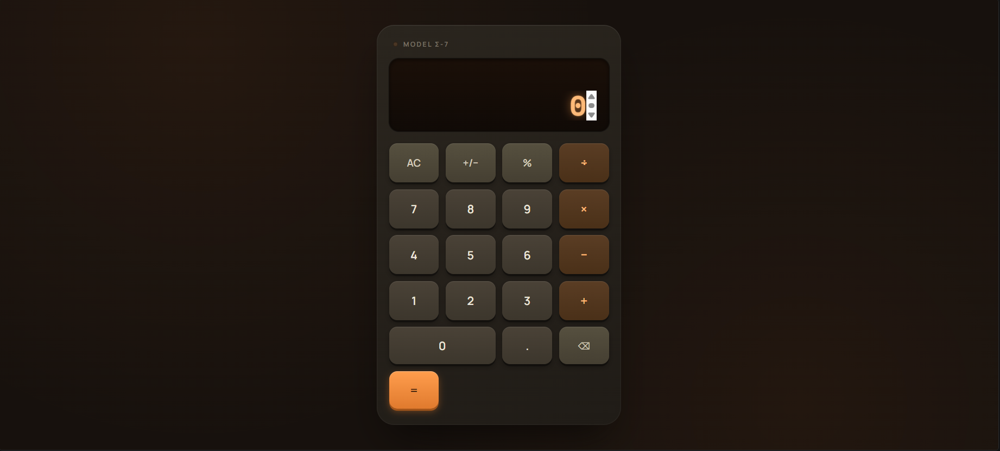
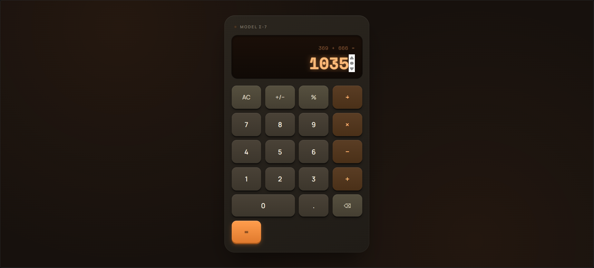

# Ex04 Simple Calculator - React Project
#### Date: 20-08-2026
#### Name : ADITHYA NM
#### Reg No : 212225040011

## AIM
To develop a Simple Calculator using React.js with clean and responsive design, ensuring a smooth user experience across different screen sizes.

## ALGORITHM

### STEP 1
Create a React + Vite application for the Simple Calculator.

### STEP 2
Clone the existing GitHub repository and install the required dependencies.

```bash
git clone https://github.com/adithyanm1982-gif/Simple-Calculator.git
cd Simple-Calculator
npm install
npm run dev
```

### STEP 3
Inside the `src/` folder, use `App.jsx` to define the calculator logic and user interface.

### STEP 4
Plan the calculator UI with a display screen, number buttons (0–9), arithmetic operators (+, −, ×, ÷), percentage, sign toggle, backspace, clear, and equal (=) functions.

### STEP 5
Use `App.css` to add the calculator styling, including the retro amber-LED appearance, display glow, buttons, and pressed-key effects.

### STEP 6
Open `src/main.jsx` and ensure that the React application is rendered through the root element and the required CSS files are imported.

### STEP 7
Start the Vite development server.

```bash
npm run dev
```

### STEP 8
Open the local Vite URL in the browser:

```text
http://localhost:5173/
```

### STEP 9
Test the calculator by entering numbers and performing addition, subtraction, multiplication, division, percentage, sign toggle, backspace, and chained operations.

### STEP 10
Test keyboard support and fix any styling or functionality issues to refine the calculator's appearance and usability.

### STEP 11
Build the project for production using:

```bash
npm run build
```

### STEP 12
Commit and push the completed project and README documentation to the GitHub repository for version control and hosting.


## PROGRAM

### src/App.css
```
.calc {
  --amber: #ff9d4d;
  --amber-bright: #ffb977;
  --body: #2a251e;
  --body-dark: #201c17;
  --key: #3c362c;
  --key-light: #4a4237;
  --stone: #56503f;

  width: min(360px, 100%);
  padding: 20px 18px 24px;
  border-radius: 26px;
  background: linear-gradient(155deg, var(--body) 0%, var(--body-dark) 100%);
  box-shadow:
    0 30px 60px -20px rgba(0, 0, 0, 0.6),
    0 0 0 1px rgba(255, 255, 255, 0.04) inset,
    0 1px 0 rgba(255, 255, 255, 0.06) inset;
}

.calc__vent {
  display: flex;
  align-items: center;
  gap: 8px;
  padding: 2px 6px 14px;
}

.calc__led {
  width: 7px;
  height: 7px;
  border-radius: 50%;
  background: #4a3624;
  box-shadow: 0 0 0 1px rgba(0, 0, 0, 0.4) inset;
  transition: background 0.2s ease, box-shadow 0.2s ease;
}

.calc__led[data-on='true'] {
  background: var(--amber);
  box-shadow: 0 0 8px 2px rgba(255, 157, 77, 0.7);
}

.calc__brand {
  font-family: 'Manrope', sans-serif;
  font-size: 10px;
  font-weight: 700;
  letter-spacing: 0.18em;
  color: #7a7264;
}

.calc__display {
  position: relative;
  overflow: hidden;
  border-radius: 14px;
  padding: 22px 18px 16px;
  margin-bottom: 18px;
  background: linear-gradient(180deg, #1a0f08 0%, #100a06 100%);
  box-shadow:
    0 2px 6px rgba(0, 0, 0, 0.5) inset,
    0 0 0 1px rgba(0, 0, 0, 0.5),
    0 1px 0 rgba(255, 255, 255, 0.03);
  text-align: right;
}

.calc__expression {
  font-family: 'Space Mono', monospace;
  font-size: 13px;
  min-height: 16px;
  color: #8a5c38;
  letter-spacing: 0.02em;
  margin-bottom: 6px;
}

.calc__value {
  font-family: 'Space Mono', monospace;
  font-size: clamp(32px, 9vw, 40px);
  font-weight: 700;
  color: var(--amber-bright);
  text-shadow: 0 0 14px rgba(255, 157, 77, 0.55), 0 0 2px rgba(255, 185, 119, 0.8);
  line-height: 1.1;
  overflow-x: auto;
  white-space: nowrap;
}

.calc__value[data-error='true'] {
  color: #ff6b6b;
  text-shadow: 0 0 14px rgba(255, 107, 107, 0.55);
  font-size: 26px;
}

.calc__scanline {
  position: absolute;
  inset: 0;
  pointer-events: none;
  background: repeating-linear-gradient(
    to bottom,
    rgba(255, 255, 255, 0.025) 0px,
    rgba(255, 255, 255, 0.025) 1px,
    transparent 1px,
    transparent 3px
  );
  mix-blend-mode: overlay;
}

.calc__pad {
  display: grid;
  grid-template-columns: repeat(4, 1fr);
  gap: 10px;
}

.key {
  font-family: 'Manrope', sans-serif;
  font-size: 17px;
  font-weight: 600;
  color: #ece6da;
  padding: 16px 0;
  border: none;
  border-radius: 12px;
  background: linear-gradient(180deg, var(--key-light) 0%, var(--key) 100%);
  box-shadow:
    0 3px 0 rgba(0, 0, 0, 0.35),
    0 4px 8px rgba(0, 0, 0, 0.3),
    0 1px 0 rgba(255, 255, 255, 0.08) inset;
  cursor: pointer;
  transition: transform 0.08s ease, box-shadow 0.08s ease;
}

.key:hover {
  background: linear-gradient(180deg, #524a3d 0%, #423b30 100%);
}

.key:active {
  transform: translateY(3px);
  box-shadow:
    0 0 0 rgba(0, 0, 0, 0.35),
    0 1px 2px rgba(0, 0, 0, 0.3),
    0 1px 0 rgba(255, 255, 255, 0.05) inset;
}

.key:focus-visible {
  outline: 2px solid var(--amber);
  outline-offset: 2px;
}

.key--func {
  color: #d8cfbf;
  background: linear-gradient(180deg, var(--stone) 0%, #453f32 100%);
  font-size: 15px;
}

.key--op {
  color: var(--amber-bright);
  background: linear-gradient(180deg, #5a3d24 0%, #4a3018 100%);
  font-size: 19px;
}

.key--active {
  background: linear-gradient(180deg, var(--amber) 0%, #cc7530 100%);
  color: #241205;
  box-shadow:
    0 3px 0 rgba(0, 0, 0, 0.35),
    0 0 12px 2px rgba(255, 157, 77, 0.5),
    0 1px 0 rgba(255, 255, 255, 0.15) inset;
}

.key--equals {
  background: linear-gradient(180deg, #ff9d4d 0%, #e07a2e 100%);
  color: #241205;
  box-shadow:
    0 3px 0 #a3551a,
    0 4px 10px rgba(224, 122, 46, 0.4),
    0 1px 0 rgba(255, 255, 255, 0.25) inset;
}

.key--equals:hover {
  background: linear-gradient(180deg, #ffab66 0%, #e6853c 100%);
}

.key--equals:active {
  transform: translateY(3px);
  box-shadow:
    0 0 0 #a3551a,
    0 1px 3px rgba(224, 122, 46, 0.3),
    0 1px 0 rgba(255, 255, 255, 0.15) inset;
}

.key--wide {
  grid-column: span 2;
}

@media (prefers-reduced-motion: reduce) {
  .key {
    transition: none;
  }
}
```

### src/App.jsx
```
import { useEffect, useState } from 'react'
import './App.css'

const OPERATORS = {
  '÷': (a, b) => a / b,
  '×': (a, b) => a * b,
  '−': (a, b) => a - b,
  '+': (a, b) => a + b,
}

function formatValue(value) {
  if (value === 'Error') return value
  const num = Number(value)
  if (Number.isNaN(num)) return '0'

  // Keep manual decimal typing intact (e.g. "12.")
  if (typeof value === 'string' && value.endsWith('.')) return value

  const str = num.toString()
  if (str.length > 11) {
    return num.toPrecision(8).replace(/\.?0+$/, '').length > 11
      ? num.toExponential(4)
      : Number(num.toPrecision(8)).toString()
  }
  return str
}

export default function App() {
  const [display, setDisplay] = useState('0')
  const [prevValue, setPrevValue] = useState(null)
  const [operator, setOperator] = useState(null)
  const [overwrite, setOverwrite] = useState(true)
  const [expression, setExpression] = useState('')

  const inputDigit = (digit) => {
    if (overwrite) {
      setDisplay(digit === '.' ? '0.' : digit)
      setOverwrite(false)
      return
    }
    if (digit === '.' && display.includes('.')) return
    if (display.replace('-', '').replace('.', '').length >= 10) return
    setDisplay(display + digit)
  }

  const clearAll = () => {
    setDisplay('0')
    setPrevValue(null)
    setOperator(null)
    setOverwrite(true)
    setExpression('')
  }

  const backspace = () => {
    if (overwrite) return
    const next = display.slice(0, -1)
    if (next === '' || next === '-') {
      setDisplay('0')
      setOverwrite(true)
    } else {
      setDisplay(next)
    }
  }

  const toggleSign = () => {
    if (display === '0') return
    setDisplay(display.startsWith('-') ? display.slice(1) : '-' + display)
  }

  const percent = () => {
    setDisplay(formatValue(String(Number(display) / 100)))
  }

  const chooseOperator = (nextOperator) => {
    if (display === 'Error') return

    if (operator && !overwrite) {
      const result = OPERATORS[operator](Number(prevValue), Number(display))
      const resultStr = Number.isFinite(result) ? formatValue(String(result)) : 'Error'
      setDisplay(resultStr)
      setPrevValue(resultStr)
      setExpression(`${formatValue(resultStr)} ${nextOperator}`)
    } else {
      setPrevValue(display)
      setExpression(`${formatValue(display)} ${nextOperator}`)
    }

    setOperator(nextOperator)
    setOverwrite(true)
  }

  const calculate = () => {
    if (operator == null || prevValue == null || display === 'Error') return
    const result = OPERATORS[operator](Number(prevValue), Number(display))
    const resultStr = Number.isFinite(result) ? formatValue(String(result)) : 'Error'
    setExpression(`${formatValue(prevValue)} ${operator} ${formatValue(display)} =`)
    setDisplay(resultStr)
    setPrevValue(null)
    setOperator(null)
    setOverwrite(true)
  }

  useEffect(() => {
    const handleKey = (e) => {
      if (e.key >= '0' && e.key <= '9') inputDigit(e.key)
      else if (e.key === '.') inputDigit('.')
      else if (e.key === '+') chooseOperator('+')
      else if (e.key === '-') chooseOperator('−')
      else if (e.key === '*') chooseOperator('×')
      else if (e.key === '/') { e.preventDefault(); chooseOperator('÷') }
      else if (e.key === 'Enter' || e.key === '=') calculate()
      else if (e.key === 'Backspace') backspace()
      else if (e.key === 'Escape') clearAll()
      else if (e.key === '%') percent()
    }
    window.addEventListener('keydown', handleKey)
    return () => window.removeEventListener('keydown', handleKey)
  })

  const isActive = (op) => operator === op && overwrite

  return (
    <div className="calc">
      <div className="calc__vent" aria-hidden="true">
        <span className="calc__led" data-on={operator != null} />
        <span className="calc__brand">MODEL Σ-7</span>
      </div>

      <div className="calc__display">
        <div className="calc__expression">{expression || '\u00A0'}</div>
        <div className="calc__value" data-error={display === 'Error'}>
          {display}
        </div>
        <div className="calc__scanline" aria-hidden="true" />
      </div>

      <div className="calc__pad">
        <button className="key key--func" onClick={clearAll}>AC</button>
        <button className="key key--func" onClick={toggleSign}>+/−</button>
        <button className="key key--func" onClick={percent}>%</button>
        <button className={`key key--op ${isActive('÷') ? 'key--active' : ''}`} onClick={() => chooseOperator('÷')}>÷</button>

        <button className="key" onClick={() => inputDigit('7')}>7</button>
        <button className="key" onClick={() => inputDigit('8')}>8</button>
        <button className="key" onClick={() => inputDigit('9')}>9</button>
        <button className={`key key--op ${isActive('×') ? 'key--active' : ''}`} onClick={() => chooseOperator('×')}>×</button>

        <button className="key" onClick={() => inputDigit('4')}>4</button>
        <button className="key" onClick={() => inputDigit('5')}>5</button>
        <button className="key" onClick={() => inputDigit('6')}>6</button>
        <button className={`key key--op ${isActive('−') ? 'key--active' : ''}`} onClick={() => chooseOperator('−')}>−</button>

        <button className="key" onClick={() => inputDigit('1')}>1</button>
        <button className="key" onClick={() => inputDigit('2')}>2</button>
        <button className="key" onClick={() => inputDigit('3')}>3</button>
        <button className={`key key--op ${isActive('+') ? 'key--active' : ''}`} onClick={() => chooseOperator('+')}>+</button>

        <button className="key key--wide" onClick={() => inputDigit('0')}>0</button>
        <button className="key" onClick={() => inputDigit('.')}>.</button>
        <button className="key key--func" onClick={backspace}>⌫</button>
        <button className="key key--equals" onClick={calculate}>=</button>
      </div>
    </div>
  )
}
```

### src/index.css
```
* {
  box-sizing: border-box;
}

html,
body {
  margin: 0;
  padding: 0;
}

body {
  min-height: 100vh;
  background: #17110d;
  background-image:
    radial-gradient(circle at 20% 10%, rgba(255, 138, 61, 0.06), transparent 45%),
    radial-gradient(circle at 80% 90%, rgba(255, 138, 61, 0.05), transparent 45%);
  font-family: 'Manrope', system-ui, sans-serif;
  -webkit-font-smoothing: antialiased;
}

#root {
  min-height: 100vh;
  display: flex;
  align-items: center;
  justify-content: center;
  padding: 24px;
}
```

### src/main.jsx
```
import React from 'react'
import ReactDOM from 'react-dom/client'
import App from './App.jsx'
import './index.css'

ReactDOM.createRoot(document.getElementById('root')).render(
  <React.StrictMode>
    <App />
  </React.StrictMode>,
)
```

### index.html
```
<!doctype html>
<html lang="en">
  <head>
    <meta charset="UTF-8" />
    <meta name="viewport" content="width=device-width, initial-scale=1.0" />
    <title>Calculator</title>
    <link rel="preconnect" href="https://fonts.googleapis.com" />
    <link rel="preconnect" href="https://fonts.gstatic.com" crossorigin />
    <link
      href="https://fonts.googleapis.com/css2?family=Space+Mono:wght@400;700&family=Manrope:wght@500;600;700;800&display=swap"
      rel="stylesheet"
    />
  </head>
  <body>
    <div id="root"></div>
    <script type="module" src="/src/main.jsx"></script>
  </body>
</html>
```

### package.json
```
{
  "name": "retro-calculator",
  "version": "0.0.0",
  "lockfileVersion": 3,
  "requires": true,
  "packages": {
    "": {
      "name": "retro-calculator",
      "version": "0.0.0",
      "dependencies": {
        "react": "^19.2.8",
        "react-dom": "^19.2.8"
      },
      "devDependencies": {
        "@types/react": "^19.2.17",
        "@types/react-dom": "^19.2.3",
        "@vitejs/plugin-react": "^6.0.4",
        "oxlint": "^1.75.0",
        "vite": "^8.2.0"
      }
    },
    "node_modules/@oxc-project/types": {
      "version": "0.146.0",
      "resolved": "https://registry.npmjs.org/@oxc-project/types/-/types-0.146.0.tgz",
      "integrity": "sha512-XC0QsnnhVe7sLIWmYmdPw7x5P0h4W8vUU3Nv1ySgWXtvCz8NizoAEpGXA0sOYoJQV2Rl13LgURAHQ5cI5ILCSA==",
      "dev": true,
      "license": "MIT",
      "funding": {
        "url": "https://github.com/sponsors/Boshen"
      }
    },
    "node_modules/@oxlint/binding-android-arm-eabi": {
      "version": "1.79.0",
      "resolved": "https://registry.npmjs.org/@oxlint/binding-android-arm-eabi/-/binding-android-arm-eabi-1.79.0.tgz",
      "integrity": "sha512-TebFaaMklO/RXzTv7PucaCq9l3X6D1gA+C8H6K4njtjFOV+zWE9MKLpulcJZN9bzytbUbQIY0mZuz12nQ5Kv4Q==",
      "cpu": [
        "arm"
      ],
      "dev": true,
      "license": "MIT",
      "optional": true,
      "os": [
        "android"
      ],
      "engines": {
        "node": "^20.19.0 || >=22.12.0"
      }
    },
    "node_modules/@oxlint/binding-android-arm64": {
      "version": "1.79.0",
      "resolved": "https://registry.npmjs.org/@oxlint/binding-android-arm64/-/binding-android-arm64-1.79.0.tgz",
      "integrity": "sha512-KqqnOtAVgNsPPF0YSodkFZA1O80jcKoCZCTu3bgsszxA+MrMP9TLzfXitKjEj1FmrPprKDMdRDMmY3weESO9sg==",
      "cpu": [
        "arm64"
      ],
      "dev": true,
      "license": "MIT",
      "optional": true,
      "os": [
        "android"
      ],
      "engines": {
        "node": "^20.19.0 || >=22.12.0"
      }
    },
    "node_modules/@oxlint/binding-darwin-arm64": {
      "version": "1.79.0",
      "resolved": "https://registry.npmjs.org/@oxlint/binding-darwin-arm64/-/binding-darwin-arm64-1.79.0.tgz",
      "integrity": "sha512-BVC2nsMzqQzRDPc5RhixkZ+m1p7iH4bxRRvqkbwDXX0PlQKm1BPy8J8cRjnAFafOq2QzI+BfO3vE8w2GZ3CBag==",
      "cpu": [
        "arm64"
      ],
      "dev": true,
      "license": "MIT",
      "optional": true,
      "os": [
        "darwin"
      ],
      "engines": {
        "node": "^20.19.0 || >=22.12.0"
      }
    },
    "node_modules/@oxlint/binding-darwin-x64": {
      "version": "1.79.0",
      "resolved": "https://registry.npmjs.org/@oxlint/binding-darwin-x64/-/binding-darwin-x64-1.79.0.tgz",
      "integrity": "sha512-p6Lm+snmhGuLKL1+CpCV8L6ijkE/qJzK2H2jG9+eKJT0n31RbY4FLsdhexekgP3bLpw4Kgde+9DZuDZQ4yIInA==",
      "cpu": [
        "x64"
      ],
      "dev": true,
      "license": "MIT",
      "optional": true,
      "os": [
        "darwin"
      ],
      "engines": {
        "node": "^20.19.0 || >=22.12.0"
      }
    },
    "node_modules/@oxlint/binding-freebsd-x64": {
      "version": "1.79.0",
      "resolved": "https://registry.npmjs.org/@oxlint/binding-freebsd-x64/-/binding-freebsd-x64-1.79.0.tgz",
      "integrity": "sha512-qDMm0dXZnoHyRqSL4N4xUq82T4sqK5cbKSjvd/dF/YbMUXc2R1wEPf+vmA5S0qUmi0nwXfNbjXBtZaIqzQLIMg==",
      "cpu": [
        "x64"
      ],
      "dev": true,
      "license": "MIT",
      "optional": true,
      "os": [
        "freebsd"
      ],
      "engines": {
        "node": "^20.19.0 || >=22.12.0"
      }
    },
    "node_modules/@oxlint/binding-linux-arm-gnueabihf": {
      "version": "1.79.0",
      "resolved": "https://registry.npmjs.org/@oxlint/binding-linux-arm-gnueabihf/-/binding-linux-arm-gnueabihf-1.79.0.tgz",
      "integrity": "sha512-2od7s0nuKPzqyUZAWk9KkCyGg7eI9dwFPZg+20lB15fKFkVZ0c9ZFxqPfiBAyDTlTkh9stPI0t+JlPCqMbItVA==",
      "cpu": [
        "arm"
      ],
      "dev": true,
      "license": "MIT",
      "optional": true,
      "os": [
        "linux"
      ],
      "engines": {
        "node": "^20.19.0 || >=22.12.0"
      }
    },
    "node_modules/@oxlint/binding-linux-arm-musleabihf": {
      "version": "1.79.0",
      "resolved": "https://registry.npmjs.org/@oxlint/binding-linux-arm-musleabihf/-/binding-linux-arm-musleabihf-1.79.0.tgz",
      "integrity": "sha512-ZOQUjkzDnvlhSE3+tWC3YXx94MMl+sYMlwH+u1+YGApGHOJP/YAc8ZBRFOXZ6eOBmxtXAWuS/fBcdZr8qqNO1A==",
      "cpu": [
        "arm"
      ],
      "dev": true,
      "license": "MIT",
      "optional": true,
      "os": [
        "linux"
      ],
      "engines": {
        "node": "^20.19.0 || >=22.12.0"
      }
    },
    "node_modules/@oxlint/binding-linux-arm64-gnu": {
      "version": "1.79.0",
      "resolved": "https://registry.npmjs.org/@oxlint/binding-linux-arm64-gnu/-/binding-linux-arm64-gnu-1.79.0.tgz",
      "integrity": "sha512-lu158FR4nGqGeRS3BQvtG85wRgU/Fy4MD5Cxp1hzJXizGiLo6u2742wJSCDKh8cFcZntvX7fcxlq4mMmfryH1g==",
      "cpu": [
        "arm64"
      ],
      "dev": true,
      "libc": [
        "glibc"
      ],
      "license": "MIT",
      "optional": true,
      "os": [
        "linux"
      ],
      "engines": {
        "node": "^20.19.0 || >=22.12.0"
      }
    },
    "node_modules/@oxlint/binding-linux-arm64-musl": {
      "version": "1.79.0",
      "resolved": "https://registry.npmjs.org/@oxlint/binding-linux-arm64-musl/-/binding-linux-arm64-musl-1.79.0.tgz",
      "integrity": "sha512-mbpKQeE2aflTjddaHK7MP8KP/OFbUM++lt5M635ENM8IyIdK0jm2t9pb+2v9mVVIvhF6TqA4l7F79Pll1mi+uw==",
      "cpu": [
        "arm64"
      ],
      "dev": true,
      "libc": [
        "musl"
      ],
      "license": "MIT",
      "optional": true,
      "os": [
        "linux"
      ],
      "engines": {
        "node": "^20.19.0 || >=22.12.0"
      }
    },
    "node_modules/@oxlint/binding-linux-ppc64-gnu": {
      "version": "1.79.0",
      "resolved": "https://registry.npmjs.org/@oxlint/binding-linux-ppc64-gnu/-/binding-linux-ppc64-gnu-1.79.0.tgz",
      "integrity": "sha512-WpGNua7gaxaHnpSDeog2ji8IDHn/QLPl9LPzwkR/FvVv58vT5BcXjRXnU+wbu3N75cpeha8CdC7ho/U2OIsB4g==",
      "cpu": [
        "ppc64"
      ],
      "dev": true,
      "libc": [
        "glibc"
      ],
      "license": "MIT",
      "optional": true,
      "os": [
        "linux"
      ],
      "engines": {
        "node": "^20.19.0 || >=22.12.0"
      }
    },
    "node_modules/@oxlint/binding-linux-riscv64-gnu": {
      "version": "1.79.0",
      "resolved": "https://registry.npmjs.org/@oxlint/binding-linux-riscv64-gnu/-/binding-linux-riscv64-gnu-1.79.0.tgz",
      "integrity": "sha512-tK1E93A5LVzISg4ngpKJnfTs7EqtIUceGI7MQ4GyDjJiLi8wPCkEyKlj2xkyKWZ1yzkDJyLHTBJ5/iFWRdnJvg==",
      "cpu": [
        "riscv64"
      ],
      "dev": true,
      "libc": [
        "glibc"
      ],
      "license": "MIT",
      "optional": true,
      "os": [
        "linux"
      ],
      "engines": {
        "node": "^20.19.0 || >=22.12.0"
      }
    },
    "node_modules/@oxlint/binding-linux-riscv64-musl": {
      "version": "1.79.0",
      "resolved": "https://registry.npmjs.org/@oxlint/binding-linux-riscv64-musl/-/binding-linux-riscv64-musl-1.79.0.tgz",
      "integrity": "sha512-qhQvUIrngXivA2A9pQ+xPCychztn/5qUv7yS3gDwXv3w7Rag+eTeeXWmRyx+t7XsW5x6LuY/8AsTq36UgFIblg==",
      "cpu": [
        "riscv64"
      ],
      "dev": true,
      "libc": [
        "musl"
      ],
      "license": "MIT",
      "optional": true,
      "os": [
        "linux"
      ],
      "engines": {
        "node": "^20.19.0 || >=22.12.0"
      }
    },
    "node_modules/@oxlint/binding-linux-s390x-gnu": {
      "version": "1.79.0",
      "resolved": "https://registry.npmjs.org/@oxlint/binding-linux-s390x-gnu/-/binding-linux-s390x-gnu-1.79.0.tgz",
      "integrity": "sha512-sv6AaVgU/eE6u+6WFiQVDcPPwTxP6IJMSB9k701W2r/r6Tx465e8vPvVyRxquNH4Vy6KwRNu90mVbxXJN8+5gg==",
      "cpu": [
        "s390x"
      ],
      "dev": true,
      "libc": [
        "glibc"
      ],
      "license": "MIT",
      "optional": true,
      "os": [
        "linux"
      ],
      "engines": {
        "node": "^20.19.0 || >=22.12.0"
      }
    },
    "node_modules/@oxlint/binding-linux-x64-gnu": {
      "version": "1.79.0",
      "resolved": "https://registry.npmjs.org/@oxlint/binding-linux-x64-gnu/-/binding-linux-x64-gnu-1.79.0.tgz",
      "integrity": "sha512-iFZL02deziHslb3jEX9KdqlAkYoo4fGyotchKDzdfK1f5mxlIBeiQeHhvK3iFpuEJSB4ma/qeFn9oxPiwnhUPQ==",
      "cpu": [
        "x64"
      ],
      "dev": true,
      "libc": [
        "glibc"
      ],
      "license": "MIT",
      "optional": true,
      "os": [
        "linux"
      ],
      "engines": {
        "node": "^20.19.0 || >=22.12.0"
      }
    },
    "node_modules/@oxlint/binding-linux-x64-musl": {
      "version": "1.79.0",
      "resolved": "https://registry.npmjs.org/@oxlint/binding-linux-x64-musl/-/binding-linux-x64-musl-1.79.0.tgz",
      "integrity": "sha512-3DtZR2raqObnh7wXZoFYFd0Fw7skBvcb3f7A+/lkEiDuh8hrE6vv9b/62Qxao1a9/OeHLw/FcXlXzgsW9wTRFg==",
      "cpu": [
        "x64"
      ],
      "dev": true,
      "libc": [
        "musl"
      ],
      "license": "MIT",
      "optional": true,
      "os": [
        "linux"
      ],
      "engines": {
        "node": "^20.19.0 || >=22.12.0"
      }
    },
    "node_modules/@oxlint/binding-openharmony-arm64": {
      "version": "1.79.0",
      "resolved": "https://registry.npmjs.org/@oxlint/binding-openharmony-arm64/-/binding-openharmony-arm64-1.79.0.tgz",
      "integrity": "sha512-Oatt4GuA1WJkqzk2ozx4HrWROOi7opV3AKDw/U8qDIqeTqzsjn5K2x3REJMNjU3/KU/Bkq96Zi3CknaiDTaC/Q==",
      "cpu": [
        "arm64"
      ],
      "dev": true,
      "license": "MIT",
      "optional": true,
      "os": [
        "openharmony"
      ],
      "engines": {
        "node": "^20.19.0 || >=22.12.0"
      }
    },
    "node_modules/@oxlint/binding-win32-arm64-msvc": {
      "version": "1.79.0",
      "resolved": "https://registry.npmjs.org/@oxlint/binding-win32-arm64-msvc/-/binding-win32-arm64-msvc-1.79.0.tgz",
      "integrity": "sha512-NAgZr9Qp8nIA9rpo0JEvwiabTF/2UVqBNnupBG9X4kxXcQoScJUTi+qHhvabb9s/thgj5wQ4XcIaJvb+ZMgoKw==",
      "cpu": [
        "arm64"
      ],
      "dev": true,
      "license": "MIT",
      "optional": true,
      "os": [
        "win32"
      ],
      "engines": {
        "node": "^20.19.0 || >=22.12.0"
      }
    },
    "node_modules/@oxlint/binding-win32-ia32-msvc": {
      "version": "1.79.0",
      "resolved": "https://registry.npmjs.org/@oxlint/binding-win32-ia32-msvc/-/binding-win32-ia32-msvc-1.79.0.tgz",
      "integrity": "sha512-+KyXjIvcpaXmWW/j9NNY5yWjrIVxaX18VyIheQy3jwc2GSYgpCr7MGI/HxIGQ/shAL5IWEKbhsqoMpAO5Stiog==",
      "cpu": [
        "ia32"
      ],
      "dev": true,
      "license": "MIT",
      "optional": true,
      "os": [
        "win32"
      ],
      "engines": {
        "node": "^20.19.0 || >=22.12.0"
      }
    },
    "node_modules/@oxlint/binding-win32-x64-msvc": {
      "version": "1.79.0",
      "resolved": "https://registry.npmjs.org/@oxlint/binding-win32-x64-msvc/-/binding-win32-x64-msvc-1.79.0.tgz",
      "integrity": "sha512-mEelcCMMBS57sIXh2veGMNy+pQwuGtcMxHxGIZWQ5Ba9pJ5jCCUFOZB9E2JhBaxGsURe+WGe0zJp4RVre52gpQ==",
      "cpu": [
        "x64"
      ],
      "dev": true,
      "license": "MIT",
      "optional": true,
      "os": [
        "win32"
      ],
      "engines": {
        "node": "^20.19.0 || >=22.12.0"
      }
    },
    "node_modules/@rolldown/binding-android-arm-eabi": {
      "version": "1.2.5",
      "resolved": "https://registry.npmjs.org/@rolldown/binding-android-arm-eabi/-/binding-android-arm-eabi-1.2.5.tgz",
      "integrity": "sha512-DLe/i+l8ynIBY7XEQ191TeZvCoowIGa18R+dIV30GW7DiOtp74i/xX8hs8GUjW5ARV7VZuie3d6AumSmCwbeRA==",
      "cpu": [
        "arm"
      ],
      "dev": true,
      "license": "MIT",
      "optional": true,
      "os": [
        "android"
      ],
      "engines": {
        "node": "^20.19.0 || >=22.12.0"
      }
    },
    "node_modules/@rolldown/binding-android-arm64": {
      "version": "1.2.5",
      "resolved": "https://registry.npmjs.org/@rolldown/binding-android-arm64/-/binding-android-arm64-1.2.5.tgz",
      "integrity": "sha512-zXcwKlQApYAOELHd8PwKDFkagYF9Wy4e0RJ+0qnzl9Pjnpj75TEG8ufv40p2J7kCEfwZAsNiuzRIyNNMWT38ig==",
      "cpu": [
        "arm64"
      ],
      "dev": true,
      "license": "MIT",
      "optional": true,
      "os": [
        "android"
      ],
      "engines": {
        "node": "^20.19.0 || >=22.12.0"
      }
    },
    "node_modules/@rolldown/binding-darwin-arm64": {
      "version": "1.2.5",
      "resolved": "https://registry.npmjs.org/@rolldown/binding-darwin-arm64/-/binding-darwin-arm64-1.2.5.tgz",
      "integrity": "sha512-dK4QakI42nzWgJT5sm4y4y/O//D4OxM75/cH28RLV+nzIN9AY+YsbuUVrUTjlLjXR6vpyxFbSsbmNuJ6BP9sww==",
      "cpu": [
        "arm64"
      ],
      "dev": true,
      "license": "MIT",
      "optional": true,
      "os": [
        "darwin"
      ],
      "engines": {
        "node": "^20.19.0 || >=22.12.0"
      }
    },
    "node_modules/@rolldown/binding-darwin-x64": {
      "version": "1.2.5",
      "resolved": "https://registry.npmjs.org/@rolldown/binding-darwin-x64/-/binding-darwin-x64-1.2.5.tgz",
      "integrity": "sha512-fqSALaUu1Wjd1nK2uW2kJDWdLCc8lx1IcY+MTY26Aurfdx19anlzhqXOgCFbBFQnlFDTn4TC1/7Nz4Bl2mLP3A==",
      "cpu": [
        "x64"
      ],
      "dev": true,
      "license": "MIT",
      "optional": true,
      "os": [
        "darwin"
      ],
      "engines": {
        "node": "^20.19.0 || >=22.12.0"
      }
    },
    "node_modules/@rolldown/binding-freebsd-x64": {
      "version": "1.2.5",
      "resolved": "https://registry.npmjs.org/@rolldown/binding-freebsd-x64/-/binding-freebsd-x64-1.2.5.tgz",
      "integrity": "sha512-/vCnNxlkxs9tKxNDcyWUePpJ/PgTzxIaVhoM5SmG8UV+GR/IcPam4VYxi7GIMo7PSDuNqlJqvprqii9NqqVCMw==",
      "cpu": [
        "x64"
      ],
      "dev": true,
      "license": "MIT",
      "optional": true,
      "os": [
        "freebsd"
      ],
      "engines": {
        "node": "^20.19.0 || >=22.12.0"
      }
    },
    "node_modules/@rolldown/binding-linux-arm-gnueabihf": {
      "version": "1.2.5",
      "resolved": "https://registry.npmjs.org/@rolldown/binding-linux-arm-gnueabihf/-/binding-linux-arm-gnueabihf-1.2.5.tgz",
      "integrity": "sha512-abk0NLA519LxRCszmbE0jYKuQ9YPocOXTiOXOo6Yr+YAT95VH+PtqYAjOJvGKt3viEd/x4qzabAlwd5bHOOARg==",
      "cpu": [
        "arm"
      ],
      "dev": true,
      "license": "MIT",
      "optional": true,
      "os": [
        "linux"
      ],
      "engines": {
        "node": "^20.19.0 || >=22.12.0"
      }
    },
    "node_modules/@rolldown/binding-linux-arm64-gnu": {
      "version": "1.2.5",
      "resolved": "https://registry.npmjs.org/@rolldown/binding-linux-arm64-gnu/-/binding-linux-arm64-gnu-1.2.5.tgz",
      "integrity": "sha512-Y7eALiJ8lr0M2HH103Js+g7V34wf6snlpZLAsHI90uLhr3PVlNsbFVAXJC9d/V6BnPyKtpSwI+NcB/RLxsQxuA==",
      "cpu": [
        "arm64"
      ],
      "dev": true,
      "libc": [
        "glibc"
      ],
      "license": "MIT",
      "optional": true,
      "os": [
        "linux"
      ],
      "engines": {
        "node": "^20.19.0 || >=22.12.0"
      }
    },
    "node_modules/@rolldown/binding-linux-arm64-musl": {
      "version": "1.2.5",
      "resolved": "https://registry.npmjs.org/@rolldown/binding-linux-arm64-musl/-/binding-linux-arm64-musl-1.2.5.tgz",
      "integrity": "sha512-xMvZgnbZg4YVnR/AX2b3oOPDTFYJvUVaJg5FedA/LuvexAtXibZQej4cnTkw3rjsJ/ggUROB64TdtETiim+FYA==",
      "cpu": [
        "arm64"
      ],
      "dev": true,
      "libc": [
        "musl"
      ],
      "license": "MIT",
      "optional": true,
      "os": [
        "linux"
      ],
      "engines": {
        "node": "^20.19.0 || >=22.12.0"
      }
    },
    "node_modules/@rolldown/binding-linux-ppc64-gnu": {
      "version": "1.2.5",
      "resolved": "https://registry.npmjs.org/@rolldown/binding-linux-ppc64-gnu/-/binding-linux-ppc64-gnu-1.2.5.tgz",
      "integrity": "sha512-GRjeqTUDHTo5GwntsLaAMcBahG3nlpjftXWZLN73HiYQlhwEowvarFgQnRnQZtIp4keXX7quXFbG38uPZBa2EA==",
      "cpu": [
        "ppc64"
      ],
      "dev": true,
      "libc": [
        "glibc"
      ],
      "license": "MIT",
      "optional": true,
      "os": [
        "linux"
      ],
      "engines": {
        "node": "^20.19.0 || >=22.12.0"
      }
    },
    "node_modules/@rolldown/binding-linux-s390x-gnu": {
      "version": "1.2.5",
      "resolved": "https://registry.npmjs.org/@rolldown/binding-linux-s390x-gnu/-/binding-linux-s390x-gnu-1.2.5.tgz",
      "integrity": "sha512-vLNTR45F2Uwc8AufkNXPmB4VliaXs+FvcheEogIzOXzO4l+LzieXF5A/TWxLy5HtqpsRCHUfd0lPVrrdgXdLHQ==",
      "cpu": [
        "s390x"
      ],
      "dev": true,
      "libc": [
        "glibc"
      ],
      "license": "MIT",
      "optional": true,
      "os": [
        "linux"
      ],
      "engines": {
        "node": "^20.19.0 || >=22.12.0"
      }
    },
    "node_modules/@rolldown/binding-linux-x64-gnu": {
      "version": "1.2.5",
      "resolved": "https://registry.npmjs.org/@rolldown/binding-linux-x64-gnu/-/binding-linux-x64-gnu-1.2.5.tgz",
      "integrity": "sha512-Mgj59/HTuYeK9Gz2MA+mBWKnHsAgkBSec15ZMb1st3oIfFbX7gCjOae7GydHhzcyQi9Z/7M1QuN9bR3oFqF0jQ==",
      "cpu": [
        "x64"
      ],
      "dev": true,
      "libc": [
        "glibc"
      ],
      "license": "MIT",
      "optional": true,
      "os": [
        "linux"
      ],
      "engines": {
        "node": "^20.19.0 || >=22.12.0"
      }
    },
    "node_modules/@rolldown/binding-linux-x64-musl": {
      "version": "1.2.5",
      "resolved": "https://registry.npmjs.org/@rolldown/binding-linux-x64-musl/-/binding-linux-x64-musl-1.2.5.tgz",
      "integrity": "sha512-mY8AP0/ichsbhAxGnLa3d3+MwV0EfgrPND2bplI3Ym8T6R2pJ0N87bvrKVwNXmdy3jnr6eQBecdqx/HMknBmpA==",
      "cpu": [
        "x64"
      ],
      "dev": true,
      "libc": [
        "musl"
      ],
      "license": "MIT",
      "optional": true,
      "os": [
        "linux"
      ],
      "engines": {
        "node": "^20.19.0 || >=22.12.0"
      }
    },
    "node_modules/@rolldown/binding-openharmony-arm64": {
      "version": "1.2.5",
      "resolved": "https://registry.npmjs.org/@rolldown/binding-openharmony-arm64/-/binding-openharmony-arm64-1.2.5.tgz",
      "integrity": "sha512-8SLssA2oweAxyRgDp789ACfRb/3P+zNRJpzZxSizxF9m8NUDQ4+3xjo8ttjhVGGw6Qxb70oZiEtIjaKikCO7Yw==",
      "cpu": [
        "arm64"
      ],
      "dev": true,
      "license": "MIT",
      "optional": true,
      "os": [
        "openharmony"
      ],
      "engines": {
        "node": "^20.19.0 || >=22.12.0"
      }
    },
    "node_modules/@rolldown/binding-win32-arm64-msvc": {
      "version": "1.2.5",
      "resolved": "https://registry.npmjs.org/@rolldown/binding-win32-arm64-msvc/-/binding-win32-arm64-msvc-1.2.5.tgz",
      "integrity": "sha512-vGbruD5zquhoc8D9SViXgN2FBJtNdTyQ4DtG+SWiEGlJiAzoKcZ2xp+xuXCffhubVdt0NJlTZqkeRuERy7g8Cw==",
      "cpu": [
        "arm64"
      ],
      "dev": true,
      "license": "MIT",
      "optional": true,
      "os": [
        "win32"
      ],
      "engines": {
        "node": "^20.19.0 || >=22.12.0"
      }
    },
    "node_modules/@rolldown/binding-win32-x64-msvc": {
      "version": "1.2.5",
      "resolved": "https://registry.npmjs.org/@rolldown/binding-win32-x64-msvc/-/binding-win32-x64-msvc-1.2.5.tgz",
      "integrity": "sha512-e/SXpgISz+IoqVcSSI0rx/d/he8zqLex+/rCWpnHpmVfmPIUjag9H6P7zotf0gJHwPUhQxZ/mF8tr6acebT9yw==",
      "cpu": [
        "x64"
      ],
      "dev": true,
      "license": "MIT",
      "optional": true,
      "os": [
        "win32"
      ],
      "engines": {
        "node": "^20.19.0 || >=22.12.0"
      }
    },
    "node_modules/@rolldown/pluginutils": {
      "version": "1.0.1",
      "resolved": "https://registry.npmjs.org/@rolldown/pluginutils/-/pluginutils-1.0.1.tgz",
      "integrity": "sha512-2j9bGt5Jh8hj+vPtgzPtl72j0yRxHAyumoo6TNfAjsLB04UtpSvPbPcDcBMxz7n+9CYB0c1GxQFxYRg2jimqGw==",
      "dev": true,
      "license": "MIT"
    },
    "node_modules/@types/react": {
      "version": "19.2.18",
      "resolved": "https://registry.npmjs.org/@types/react/-/react-19.2.18.tgz",
      "integrity": "sha512-AnzbBERsrLKtk2XSfTbYRLjQPdy116Sty4q+T+Bp3IC4l6jNBvreVPAHmpq9qhXQM7CXZPjLVmGMw9sy+hxQ3w==",
      "dev": true,
      "license": "MIT",
      "dependencies": {
        "csstype": "^3.2.2"
      }
    },
    "node_modules/@types/react-dom": {
      "version": "19.2.4",
      "resolved": "https://registry.npmjs.org/@types/react-dom/-/react-dom-19.2.4.tgz",
      "integrity": "sha512-Bsc+QHgp+P/F02XDzNCY9jnZNCUuLki36KT7VKrTXXLdHf+vHMNZnW1rVu5DNW/rCK+fya3DATySbLM4yhtKUw==",
      "dev": true,
      "license": "MIT",
      "peerDependencies": {
        "@types/react": "^19.2.0"
      }
    },
    "node_modules/@vitejs/plugin-react": {
      "version": "6.1.0",
      "resolved": "https://registry.npmjs.org/@vitejs/plugin-react/-/plugin-react-6.1.0.tgz",
      "integrity": "sha512-qd2BzUBehkov86WFhg0JkEFEYyCLG9uPCe6qWTY/kRlss9OvJrOF2UbIWT7p+8IzZHkEu0DNGHc4HSv+JdDLsw==",
      "dev": true,
      "license": "MIT",
      "dependencies": {
        "@rolldown/pluginutils": "^1.0.1"
      },
      "engines": {
        "node": "^20.19.0 || >=22.12.0"
      },
      "peerDependencies": {
        "@rolldown/plugin-babel": "^0.1.7 || ^0.2.0",
        "babel-plugin-react-compiler": "^1.0.0",
        "oxc-transform-react": "^0.145.0",
        "vite": "^8.0.0"
      },
      "peerDependenciesMeta": {
        "@rolldown/plugin-babel": {
          "optional": true
        },
        "babel-plugin-react-compiler": {
          "optional": true
        },
        "oxc-transform-react": {
          "optional": true
        }
      }
    },
    "node_modules/csstype": {
      "version": "3.2.3",
      "resolved": "https://registry.npmjs.org/csstype/-/csstype-3.2.3.tgz",
      "integrity": "sha512-z1HGKcYy2xA8AGQfwrn0PAy+PB7X/GSj3UVJW9qKyn43xWa+gl5nXmU4qqLMRzWVLFC8KusUX8T/0kCiOYpAIQ==",
      "dev": true,
      "license": "MIT"
    },
    "node_modules/detect-libc": {
      "version": "2.1.2",
      "resolved": "https://registry.npmjs.org/detect-libc/-/detect-libc-2.1.2.tgz",
      "integrity": "sha512-Btj2BOOO83o3WyH59e8MgXsxEQVcarkUOpEYrubB0urwnN10yQ364rsiByU11nZlqWYZm05i/of7io4mzihBtQ==",
      "dev": true,
      "license": "Apache-2.0",
      "engines": {
        "node": ">=8"
      }
    },
    "node_modules/fdir": {
      "version": "6.5.0",
      "resolved": "https://registry.npmjs.org/fdir/-/fdir-6.5.0.tgz",
      "integrity": "sha512-tIbYtZbucOs0BRGqPJkshJUYdL+SDH7dVM8gjy+ERp3WAUjLEFJE+02kanyHtwjWOnwrKYBiwAmM0p4kLJAnXg==",
      "dev": true,
      "license": "MIT",
      "engines": {
        "node": ">=12.0.0"
      },
      "peerDependencies": {
        "picomatch": "^3 || ^4"
      },
      "peerDependenciesMeta": {
        "picomatch": {
          "optional": true
        }
      }
    },
    "node_modules/fsevents": {
      "version": "2.3.3",
      "resolved": "https://registry.npmjs.org/fsevents/-/fsevents-2.3.3.tgz",
      "integrity": "sha512-5xoDfX+fL7faATnagmWPpbFtwh/R77WmMMqqHGS65C3vvB0YHrgF+B1YmZ3441tMj5n63k0212XNoJwzlhffQw==",
      "dev": true,
      "hasInstallScript": true,
      "license": "MIT",
      "optional": true,
      "os": [
        "darwin"
      ],
      "engines": {
        "node": "^8.16.0 || ^10.6.0 || >=11.0.0"
      }
    },
    "node_modules/lightningcss": {
      "version": "1.33.0",
      "resolved": "https://registry.npmjs.org/lightningcss/-/lightningcss-1.33.0.tgz",
      "integrity": "sha512-WkUDrojuJs0xkgGf2udWxa3yGBRxPtxUkB79i6aCZLRgc7PM8fZe9TosfPDcvEpQZbuFASnHYmRLBLUbmLOIIA==",
      "dev": true,
      "license": "MPL-2.0",
      "dependencies": {
        "detect-libc": "^2.0.3"
      },
      "engines": {
        "node": ">= 12.0.0"
      },
      "funding": {
        "type": "opencollective",
        "url": "https://opencollective.com/parcel"
      },
      "optionalDependencies": {
        "lightningcss-android-arm64": "1.33.0",
        "lightningcss-darwin-arm64": "1.33.0",
        "lightningcss-darwin-x64": "1.33.0",
        "lightningcss-freebsd-x64": "1.33.0",
        "lightningcss-linux-arm-gnueabihf": "1.33.0",
        "lightningcss-linux-arm64-gnu": "1.33.0",
        "lightningcss-linux-arm64-musl": "1.33.0",
        "lightningcss-linux-x64-gnu": "1.33.0",
        "lightningcss-linux-x64-musl": "1.33.0",
        "lightningcss-win32-arm64-msvc": "1.33.0",
        "lightningcss-win32-x64-msvc": "1.33.0"
      }
    },
    "node_modules/lightningcss-android-arm64": {
      "version": "1.33.0",
      "resolved": "https://registry.npmjs.org/lightningcss-android-arm64/-/lightningcss-android-arm64-1.33.0.tgz",
      "integrity": "sha512-gEpRTalKdosp4Bb8qWtc2iOgE5SeIHlpS1up9bFq2wAyYhl1UdTObYiHe98zEM9SQvSoqQZ1IQD0JNpg3Ml5pg==",
      "cpu": [
        "arm64"
      ],
      "dev": true,
      "license": "MPL-2.0",
      "optional": true,
      "os": [
        "android"
      ],
      "engines": {
        "node": ">= 12.0.0"
      },
      "funding": {
        "type": "opencollective",
        "url": "https://opencollective.com/parcel"
      }
    },
    "node_modules/lightningcss-darwin-arm64": {
      "version": "1.33.0",
      "resolved": "https://registry.npmjs.org/lightningcss-darwin-arm64/-/lightningcss-darwin-arm64-1.33.0.tgz",
      "integrity": "sha512-Sciaz8eenNTKn9b3t7+xr0ipTp9YxKQY4npwQ3mrRuL0BAVHBLyZxofhaKBAVtzmtRZ/zTyo0/to4B1uWG/Djg==",
      "cpu": [
        "arm64"
      ],
      "dev": true,
      "license": "MPL-2.0",
      "optional": true,
      "os": [
        "darwin"
      ],
      "engines": {
        "node": ">= 12.0.0"
      },
      "funding": {
        "type": "opencollective",
        "url": "https://opencollective.com/parcel"
      }
    },
    "node_modules/lightningcss-darwin-x64": {
      "version": "1.33.0",
      "resolved": "https://registry.npmjs.org/lightningcss-darwin-x64/-/lightningcss-darwin-x64-1.33.0.tgz",
      "integrity": "sha512-Z5UPAxzrjlWNNyGy6i65cJzzvgJ5D3T6wMvs+gWpY9d7qRhANrxqAp6LhxIgZhWEw18RfJTGcRxjuLIBr+m8XQ==",
      "cpu": [
        "x64"
      ],
      "dev": true,
      "license": "MPL-2.0",
      "optional": true,
      "os": [
        "darwin"
      ],
      "engines": {
        "node": ">= 12.0.0"
      },
      "funding": {
        "type": "opencollective",
        "url": "https://opencollective.com/parcel"
      }
    },
    "node_modules/lightningcss-freebsd-x64": {
      "version": "1.33.0",
      "resolved": "https://registry.npmjs.org/lightningcss-freebsd-x64/-/lightningcss-freebsd-x64-1.33.0.tgz",
      "integrity": "sha512-QQM/Ti/hQajJwCY+RiWuCZ9sdtI/XQk7nDK5vC8kkdwixezOlDgvDx7+RT+QjK6FcFT4MpsuoBnHIo/O3StRRg==",
      "cpu": [
        "x64"
      ],
      "dev": true,
      "license": "MPL-2.0",
      "optional": true,
      "os": [
        "freebsd"
      ],
      "engines": {
        "node": ">= 12.0.0"
      },
      "funding": {
        "type": "opencollective",
        "url": "https://opencollective.com/parcel"
      }
    },
    "node_modules/lightningcss-linux-arm-gnueabihf": {
      "version": "1.33.0",
      "resolved": "https://registry.npmjs.org/lightningcss-linux-arm-gnueabihf/-/lightningcss-linux-arm-gnueabihf-1.33.0.tgz",
      "integrity": "sha512-N7FVBe6iS24MlM6R/4RBTxGhQheZGs7tiQ9U32UtF75NzP5Q7xWPRqLBCKxlRQRk3rY1jCIPLzx7WzOhuUIRLQ==",
      "cpu": [
        "arm"
      ],
      "dev": true,
      "license": "MPL-2.0",
      "optional": true,
      "os": [
        "linux"
      ],
      "engines": {
        "node": ">= 12.0.0"
      },
      "funding": {
        "type": "opencollective",
        "url": "https://opencollective.com/parcel"
      }
    },
    "node_modules/lightningcss-linux-arm64-gnu": {
      "version": "1.33.0",
      "resolved": "https://registry.npmjs.org/lightningcss-linux-arm64-gnu/-/lightningcss-linux-arm64-gnu-1.33.0.tgz",
      "integrity": "sha512-j2v/itmy4HlNxlc6voKXYgBqNi0Ng2LShg4z7GufpEgs05P+2suBVyi9I6YHq5uoVFx9ETin3eCEhLVyXGQnKg==",
      "cpu": [
        "arm64"
      ],
      "dev": true,
      "libc": [
        "glibc"
      ],
      "license": "MPL-2.0",
      "optional": true,
      "os": [
        "linux"
      ],
      "engines": {
        "node": ">= 12.0.0"
      },
      "funding": {
        "type": "opencollective",
        "url": "https://opencollective.com/parcel"
      }
    },
    "node_modules/lightningcss-linux-arm64-musl": {
      "version": "1.33.0",
      "resolved": "https://registry.npmjs.org/lightningcss-linux-arm64-musl/-/lightningcss-linux-arm64-musl-1.33.0.tgz",
      "integrity": "sha512-yiO5ROMuYQgXbC60yjZU5CYSFZGKXL0HFATXt9mHJn1+zW55oCtMI9NfcVhYLMFDL7gV7oBPon/EmMMGg2OvtQ==",
      "cpu": [
        "arm64"
      ],
      "dev": true,
      "libc": [
        "musl"
      ],
      "license": "MPL-2.0",
      "optional": true,
      "os": [
        "linux"
      ],
      "engines": {
        "node": ">= 12.0.0"
      },
      "funding": {
        "type": "opencollective",
        "url": "https://opencollective.com/parcel"
      }
    },
    "node_modules/lightningcss-linux-x64-gnu": {
      "version": "1.33.0",
      "resolved": "https://registry.npmjs.org/lightningcss-linux-x64-gnu/-/lightningcss-linux-x64-gnu-1.33.0.tgz",
      "integrity": "sha512-ar+Ju7LmcN0Jo4FpL4hpFybwNG9/3A/Br5KW2n2jyODg3MEZXaDYADdemoNS+BDNfMgKvylJLj4S5tyRActuAg==",
      "cpu": [
        "x64"
      ],
      "dev": true,
      "libc": [
        "glibc"
      ],
      "license": "MPL-2.0",
      "optional": true,
      "os": [
        "linux"
      ],
      "engines": {
        "node": ">= 12.0.0"
      },
      "funding": {
        "type": "opencollective",
        "url": "https://opencollective.com/parcel"
      }
    },
    "node_modules/lightningcss-linux-x64-musl": {
      "version": "1.33.0",
      "resolved": "https://registry.npmjs.org/lightningcss-linux-x64-musl/-/lightningcss-linux-x64-musl-1.33.0.tgz",
      "integrity": "sha512-RYiYbkokw0trfKqqzfF55lginwEPrD3OJDfTuJzFs1MK6iFnDenaz1fqLLtX4ITG3OktJQXOeTaw1awrBAlZPw==",
      "cpu": [
        "x64"
      ],
      "dev": true,
      "libc": [
        "musl"
      ],
      "license": "MPL-2.0",
      "optional": true,
      "os": [
        "linux"
      ],
      "engines": {
        "node": ">= 12.0.0"
      },
      "funding": {
        "type": "opencollective",
        "url": "https://opencollective.com/parcel"
      }
    },
    "node_modules/lightningcss-win32-arm64-msvc": {
      "version": "1.33.0",
      "resolved": "https://registry.npmjs.org/lightningcss-win32-arm64-msvc/-/lightningcss-win32-arm64-msvc-1.33.0.tgz",
      "integrity": "sha512-1K+MPfLSFVpphzpdbfkhlWk6wBrTObBzS2T6db10PNOZgR9GoVsAWzwNyuhUYYbTp23j+4RrncfujZ4uAzXvwA==",
      "cpu": [
        "arm64"
      ],
      "dev": true,
      "license": "MPL-2.0",
      "optional": true,
      "os": [
        "win32"
      ],
      "engines": {
        "node": ">= 12.0.0"
      },
      "funding": {
        "type": "opencollective",
        "url": "https://opencollective.com/parcel"
      }
    },
    "node_modules/lightningcss-win32-x64-msvc": {
      "version": "1.33.0",
      "resolved": "https://registry.npmjs.org/lightningcss-win32-x64-msvc/-/lightningcss-win32-x64-msvc-1.33.0.tgz",
      "integrity": "sha512-OlEICDx/Xl0FqSp4bry8zFnCvGpig3Gl4gCquvYwHuqJKEC1+n9NgDniFvqHGmMv1ZkqDJrDqKKSykTDX+ehuA==",
      "cpu": [
        "x64"
      ],
      "dev": true,
      "license": "MPL-2.0",
      "optional": true,
      "os": [
        "win32"
      ],
      "engines": {
        "node": ">= 12.0.0"
      },
      "funding": {
        "type": "opencollective",
        "url": "https://opencollective.com/parcel"
      }
    },
    "node_modules/nanoid": {
      "version": "3.3.18",
      "resolved": "https://registry.npmjs.org/nanoid/-/nanoid-3.3.18.tgz",
      "integrity": "sha512-DTg4MJbGMWkfi6VZFdNt2/caMbQy4Ou+Op/hJQvGEWcnVfoA1QA+xzRKAzw9jD6+GVOOeYr/mIcuDSdug6F6+w==",
      "dev": true,
      "funding": [
        {
          "type": "github",
          "url": "https://github.com/sponsors/ai"
        }
      ],
      "license": "MIT",
      "bin": {
        "nanoid": "bin/nanoid.cjs"
      },
      "engines": {
        "node": "^10 || ^12 || ^13.7 || ^14 || >=15.0.1"
      }
    },
    "node_modules/oxlint": {
      "version": "1.79.0",
      "resolved": "https://registry.npmjs.org/oxlint/-/oxlint-1.79.0.tgz",
      "integrity": "sha512-hVJ9hq9m2unPS+Of4eJJgCPdIeCC+3DHEUX3tkmrPJr3OK2hz7PhXwgC+ZP71ZcYu8cCDEtQrqLxWNvxBppBVg==",
      "dev": true,
      "license": "MIT",
      "bin": {
        "oxlint": "bin/oxlint"
      },
      "engines": {
        "node": "^20.19.0 || >=22.12.0"
      },
      "funding": {
        "url": "https://github.com/sponsors/Boshen"
      },
      "optionalDependencies": {
        "@oxlint/binding-android-arm-eabi": "1.79.0",
        "@oxlint/binding-android-arm64": "1.79.0",
        "@oxlint/binding-darwin-arm64": "1.79.0",
        "@oxlint/binding-darwin-x64": "1.79.0",
        "@oxlint/binding-freebsd-x64": "1.79.0",
        "@oxlint/binding-linux-arm-gnueabihf": "1.79.0",
        "@oxlint/binding-linux-arm-musleabihf": "1.79.0",
        "@oxlint/binding-linux-arm64-gnu": "1.79.0",
        "@oxlint/binding-linux-arm64-musl": "1.79.0",
        "@oxlint/binding-linux-ppc64-gnu": "1.79.0",
        "@oxlint/binding-linux-riscv64-gnu": "1.79.0",
        "@oxlint/binding-linux-riscv64-musl": "1.79.0",
        "@oxlint/binding-linux-s390x-gnu": "1.79.0",
        "@oxlint/binding-linux-x64-gnu": "1.79.0",
        "@oxlint/binding-linux-x64-musl": "1.79.0",
        "@oxlint/binding-openharmony-arm64": "1.79.0",
        "@oxlint/binding-win32-arm64-msvc": "1.79.0",
        "@oxlint/binding-win32-ia32-msvc": "1.79.0",
        "@oxlint/binding-win32-x64-msvc": "1.79.0"
      },
      "peerDependencies": {
        "oxlint-tsgolint": ">=7.0.2001",
        "vite-plus": "*"
      },
      "peerDependenciesMeta": {
        "oxlint-tsgolint": {
          "optional": true
        },
        "vite-plus": {
          "optional": true
        }
      }
    },
    "node_modules/picocolors": {
      "version": "1.1.1",
      "resolved": "https://registry.npmjs.org/picocolors/-/picocolors-1.1.1.tgz",
      "integrity": "sha512-xceH2snhtb5M9liqDsmEw56le376mTZkEX/jEb/RxNFyegNul7eNslCXP9FDj/Lcu0X8KEyMceP2ntpaHrDEVA==",
      "dev": true,
      "license": "ISC"
    },
    "node_modules/picomatch": {
      "version": "4.0.5",
      "resolved": "https://registry.npmjs.org/picomatch/-/picomatch-4.0.5.tgz",
      "integrity": "sha512-RvwwcruNjI1ncT5xRakeyS9Lf8lcItv34KD+aif+VH9kduAyfYBipGh12274xtenIPZ119/R9BdTBa8gAwSh0A==",
      "dev": true,
      "license": "MIT",
      "engines": {
        "node": ">=12"
      },
      "funding": {
        "url": "https://github.com/sponsors/jonschlinkert"
      }
    },
    "node_modules/postcss": {
      "version": "8.5.26",
      "resolved": "https://registry.npmjs.org/postcss/-/postcss-8.5.26.tgz",
      "integrity": "sha512-u82N74LFzG8ca+dD8puPnplTXoGH4fTPpVGuIbt36G3qvNlkvfD0lEAZSxaly3KX8TS/L1A1gsCEmvKmBcVbkQ==",
      "dev": true,
      "funding": [
        {
          "type": "opencollective",
          "url": "https://opencollective.com/postcss/"
        },
        {
          "type": "tidelift",
          "url": "https://tidelift.com/funding/github/npm/postcss"
        },
        {
          "type": "github",
          "url": "https://github.com/sponsors/ai"
        }
      ],
      "license": "MIT",
      "dependencies": {
        "nanoid": "^3.3.17",
        "picocolors": "^1.1.1",
        "source-map-js": "^1.2.1"
      },
      "engines": {
        "node": "^10 || ^12 || >=14"
      }
    },
    "node_modules/react": {
      "version": "19.2.8",
      "resolved": "https://registry.npmjs.org/react/-/react-19.2.8.tgz",
      "integrity": "sha512-PWaYA1L/q9u2u7xYQi+Y3L3Yfnie7XyLeaJICV1MGD6LprsBxcAqGjYyr0eY3p+QdsA+x/Irkt4Qif8D63+Sbw==",
      "license": "MIT",
      "engines": {
        "node": ">=0.10.0"
      }
    },
    "node_modules/react-dom": {
      "version": "19.2.8",
      "resolved": "https://registry.npmjs.org/react-dom/-/react-dom-19.2.8.tgz",
      "integrity": "sha512-rVprimfGBG3DR+Tq0IQG2DT5PxKth1WIGDmj5yPmlzr4YBe7uyE+Du4oVqTDXZSHGGGXRtTJEGSSePyQCMBglQ==",
      "license": "MIT",
      "dependencies": {
        "scheduler": "^0.27.0"
      },
      "peerDependencies": {
        "react": "^19.2.8"
      }
    },
    "node_modules/rolldown": {
      "version": "1.2.5",
      "resolved": "https://registry.npmjs.org/rolldown/-/rolldown-1.2.5.tgz",
      "integrity": "sha512-VD2IE5PUG4Oj8zz2VGykiYd5wbnjdIiSsNQb8Qu5B+noEp+A78mu2iVvpp27g8es14Tk9rofNs5Tku9iQCS4fA==",
      "dev": true,
      "license": "MIT",
      "dependencies": {
        "@oxc-project/types": "=0.146.0",
        "@rolldown/pluginutils": "^1.0.0"
      },
      "bin": {
        "rolldown": "bin/cli.mjs"
      },
      "engines": {
        "node": "^20.19.0 || >=22.12.0"
      },
      "optionalDependencies": {
        "@rolldown/binding-android-arm-eabi": "1.2.5",
        "@rolldown/binding-android-arm64": "1.2.5",
        "@rolldown/binding-darwin-arm64": "1.2.5",
        "@rolldown/binding-darwin-x64": "1.2.5",
        "@rolldown/binding-freebsd-x64": "1.2.5",
        "@rolldown/binding-linux-arm-gnueabihf": "1.2.5",
        "@rolldown/binding-linux-arm64-gnu": "1.2.5",
        "@rolldown/binding-linux-arm64-musl": "1.2.5",
        "@rolldown/binding-linux-ppc64-gnu": "1.2.5",
        "@rolldown/binding-linux-s390x-gnu": "1.2.5",
        "@rolldown/binding-linux-x64-gnu": "1.2.5",
        "@rolldown/binding-linux-x64-musl": "1.2.5",
        "@rolldown/binding-openharmony-arm64": "1.2.5",
        "@rolldown/binding-win32-arm64-msvc": "1.2.5",
        "@rolldown/binding-win32-x64-msvc": "1.2.5"
      }
    },
    "node_modules/scheduler": {
      "version": "0.27.0",
      "resolved": "https://registry.npmjs.org/scheduler/-/scheduler-0.27.0.tgz",
      "integrity": "sha512-eNv+WrVbKu1f3vbYJT/xtiF5syA5HPIMtf9IgY/nKg0sWqzAUEvqY/xm7OcZc/qafLx/iO9FgOmeSAp4v5ti/Q==",
      "license": "MIT"
    },
    "node_modules/source-map-js": {
      "version": "1.2.1",
      "resolved": "https://registry.npmjs.org/source-map-js/-/source-map-js-1.2.1.tgz",
      "integrity": "sha512-UXWMKhLOwVKb728IUtQPXxfYU+usdybtUrK/8uGE8CQMvrhOpwvzDBwj0QhSL7MQc7vIsISBG8VQ8+IDQxpfQA==",
      "dev": true,
      "license": "BSD-3-Clause",
      "engines": {
        "node": ">=0.10.0"
      }
    },
    "node_modules/tinyglobby": {
      "version": "0.2.17",
      "resolved": "https://registry.npmjs.org/tinyglobby/-/tinyglobby-0.2.17.tgz",
      "integrity": "sha512-wXR/dYpcqKmfWpEdZjiKJOwCNFndD0DMnrW/cYjVGttEkBfVgcLFHoNrlj47mjOVic9yyNu65alsgF4NQyTa2g==",
      "dev": true,
      "license": "MIT",
      "dependencies": {
        "fdir": "^6.5.0",
        "picomatch": "^4.0.4"
      },
      "engines": {
        "node": ">=12.0.0"
      },
      "funding": {
        "url": "https://github.com/sponsors/SuperchupuDev"
      }
    },
    "node_modules/vite": {
      "version": "8.2.2",
      "resolved": "https://registry.npmjs.org/vite/-/vite-8.2.2.tgz",
      "integrity": "sha512-cFKLV/PRgAUlIRm5WjMjJ86jrftzpqcgH+Us+DS8mI3CDNiH30Whrz8uHL3+MOLPAgqbMBAqWdAHAphOAM+z/Q==",
      "dev": true,
      "license": "MIT",
      "dependencies": {
        "lightningcss": "^1.33.0",
        "picomatch": "^4.0.5",
        "postcss": "^8.5.26",
        "rolldown": "~1.2.4",
        "tinyglobby": "^0.2.17"
      },
      "bin": {
        "vite": "bin/vite.js"
      },
      "engines": {
        "node": "^20.19.0 || >=22.12.0"
      },
      "funding": {
        "url": "https://github.com/vitejs/vite?sponsor=1"
      },
      "optionalDependencies": {
        "fsevents": "~2.3.3"
      },
      "peerDependencies": {
        "@types/node": "^20.19.0 || >=22.12.0",
        "@vitejs/devtools": "^0.4.0 || ^0.5.0",
        "esbuild": "^0.27.0 || ^0.28.0",
        "jiti": ">=1.21.0",
        "less": "^4.0.0",
        "sass": "^1.70.0",
        "sass-embedded": "^1.70.0",
        "stylus": ">=0.54.8",
        "sugarss": "^5.0.0",
        "terser": "^5.16.0",
        "tsx": "^4.8.1",
        "yaml": "^2.4.2"
      },
      "peerDependenciesMeta": {
        "@types/node": {
          "optional": true
        },
        "@vitejs/devtools": {
          "optional": true
        },
        "esbuild": {
          "optional": true
        },
        "jiti": {
          "optional": true
        },
        "less": {
          "optional": true
        },
        "sass": {
          "optional": true
        },
        "sass-embedded": {
          "optional": true
        },
        "stylus": {
          "optional": true
        },
        "sugarss": {
          "optional": true
        },
        "terser": {
          "optional": true
        },
        "tsx": {
          "optional": true
        },
        "yaml": {
          "optional": true
        }
      }
    }
  }
}
```

## OUTPUT




## RESULT
The program for developing a simple calculator in React.js is executed successfully.